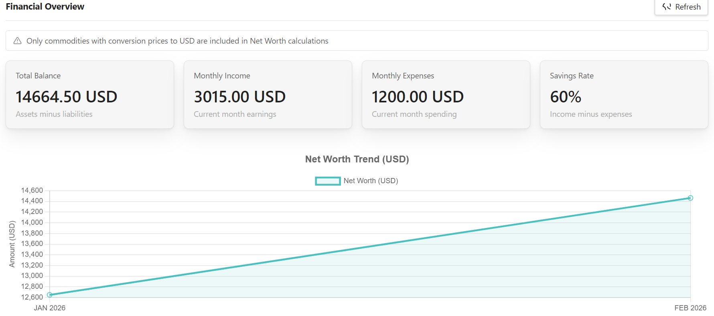
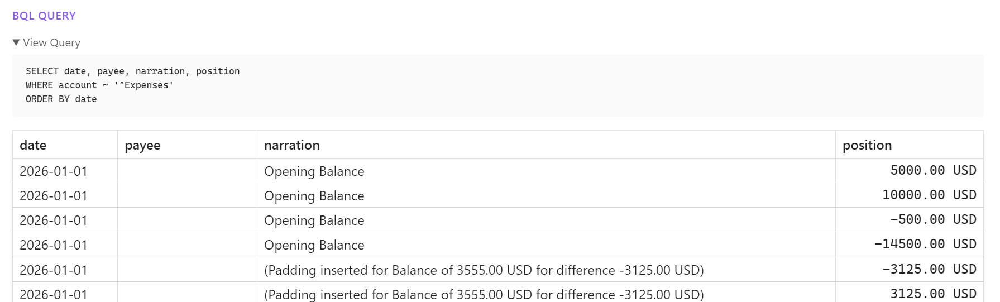
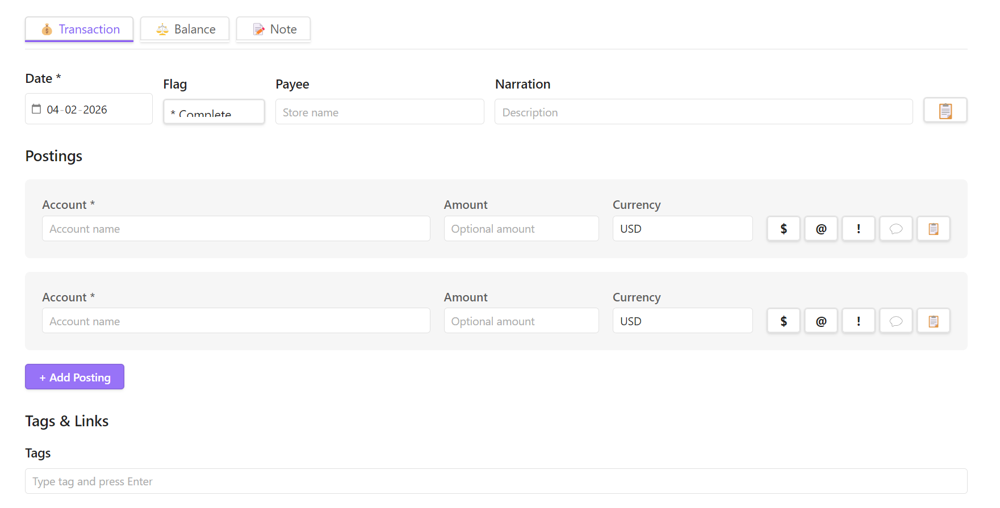

# Beancount for Obsidian


A comprehensive Beancount integration for [Obsidian](https://obsidian.md) that transforms your vault into a powerful plain-text accounting dashboard.

📘 **[Full Documentation](https://mkshp-dev.github.io/obsidian-finance-plugin/)** - Read the complete guide for features, configuration, and usage.

---

## ✨ Key Features


<p align="center"><em>📊 Unified Dashboard - Net worth tracking, balance sheets, and interactive charts in one view</em></p>

<details>
<summary><strong>🔍 Live BQL Queries</strong> - Click to see</summary>
<br/>

<p align="center"><em>Embed dynamic financial data directly in your notes with shorthand support</em></p>
</details>

<details>
<summary><strong>⚡ Smart Transaction Entry</strong> - Click to see</summary>
<br/>

<p align="center"><em>Quick transaction creation with account autocomplete and validation</em></p>
</details>

**Highlights:**
- 📈 Real-time financial metrics and trend visualization
- 📝 Inline BQL queries with customizable shortcuts
- 💰 Complete transaction, balance, and commodity management
- 🔄 Direct Beancount file integration—no separate database

---

## 🔧 Requirements

This plugin integrates with your existing Beancount setup:

1. **Python 3.8+**
2. **Beancount v3+**: Install via `pip install beancount`
3. **bean-query**: Command-line tool for querying Beancount files
4. **bean-price** *(optional)*: For automatic commodity price fetching
5. **WSL Support** *(optional)*: Full compatibility for Windows users running Beancount in WSL

---

## 📦 Installation

### Manual Installation
1. Download the latest release from [GitHub Releases](https://github.com/mkshp-dev/obsidian-finance-plugin/releases)
2. Extract files to `<vault>/.obsidian/plugins/obsidian-finance-plugin/`
3. Enable the plugin in Obsidian Settings → Community Plugins

### BRAT Beta Installation

For beta testers who want to try the latest development version:

1. **Install BRAT Plugin**: 
   - Install [BRAT (Beta Reviewers Auto-update Tester)](https://github.com/TfTHacker/obsidian42-brat) from Obsidian Community Plugins
   - Enable BRAT in your Community Plugins settings

2. **Add Beta Plugin**:
   - Open Command Palette (`Ctrl/Cmd + P`)
   - Run: "BRAT: Add a beta plugin for testing"
   - Enter repository: `mkshp-dev/obsidian-finance-plugin`
   - Select branch: `dev` (or `master` for stable)

3. **Enable Plugin**:
   - Go to Settings → Community Plugins
   - Find "Beancount for Obsidian" and enable it

BRAT will automatically check for updates and notify you of new versions. This is the recommended way to test beta features before official releases.

**Note**: Beta versions may have bugs. Always keep backups of your Beancount files and vault data.

---

## 🤝 Contributing

We welcome contributions! Please see our `CONTRIBUTING.md` for details.

### Development Setup

```bash
# Clone the repository
git clone https://github.com/mkshp-dev/obsidian-finance-plugin.git
cd obsidian-finance-plugin

# Install dependencies
npm install

# Start development build
npm run dev

# Build for production
npm run build
```

---

## 📝 License

This project is licensed under the MIT License - see the [LICENSE](LICENSE) file for details.

## Support
If this project helps your workflow, consider supporting its development with a ☕

<a href="https://www.buymeacoffee.com/mkshp" target="_blank">
  
</a>
