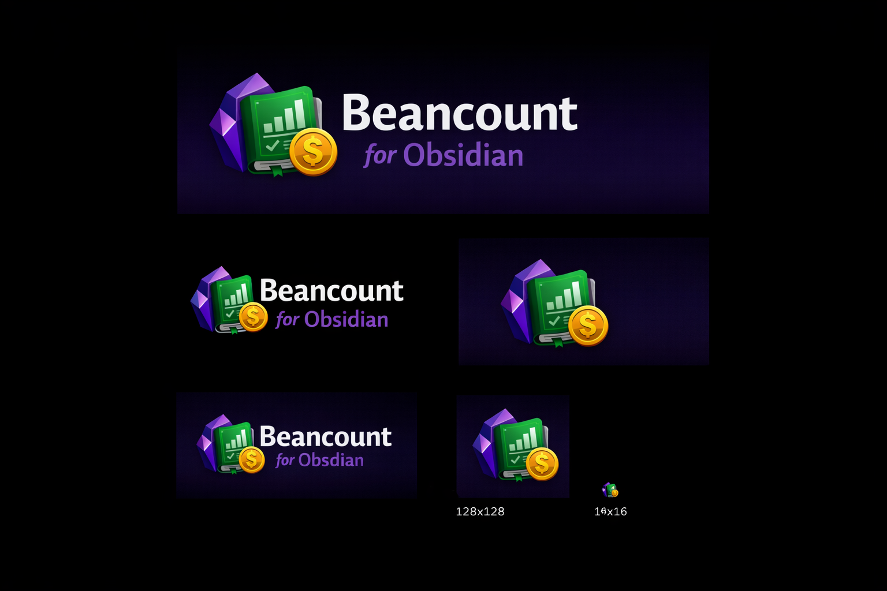

# Beancount Ledger



[](https://github.com/mkshp-dev/obsidian-finance-plugin/actions/workflows/ci.yml)
[](https://mkshp-dev.github.io/obsidian-finance-plugin/)
[](LICENSE)
[](https://obsidian.md)

A comprehensive Beancount integration for [Obsidian](https://obsidian.md) that transforms your vault into a powerful plain-text accounting dashboard.

📘 **[Full Documentation Portal](https://mkshp-dev.github.io/obsidian-finance-plugin/)** — Read the complete guide for features, configuration, and usage.

---

## ✨ Features

*   **📊 Unified Dashboard** — Overview, Transactions, Journal, Accounts & Balances, Income Statement, and Commodities tabs, all backed by live Beancount Query Language (BQL).
*   **💸 Transaction Management** — Add transactions, balance assertions, and notes through a friendly modal instead of hand-writing plain text.
*   **📅 Scheduled & Recurring Transactions** — Define one-time or repeating transactions (rent, subscriptions, insurance) from the Snapshot sidebar. Click Refresh to see what's due — including every occurrence a schedule has fallen behind on — and Insert, Skip, or Hold each one individually.
*   **✅ Reconciliation Tracking** — Assign a reconciliation interval to any account and get an at-a-glance overdue/up-to-date summary in the Snapshot sidebar.
*   **🪙 Bean Price Integration** — Automated market value updates for stocks, mutual funds, ETFs, and cryptocurrencies.
*   **📁 Structured Layout** — Automatically split large journals into clean, organized files (accounts, prices, transactions by year, and more).
*   **📝 Pro-grade File Editor** — A full `.beancount` editor view with live syntax highlighting, diagnostics, smart indentation, and autocompletion.
*   **⚡ User Snippets** — Define your own transaction snippets in `snippets.beancount` and autocomplete them right from the editor.
*   **🔒 Privacy First** — Fully local; your financial data never leaves your device.

See the [Documentation Portal](https://mkshp-dev.github.io/obsidian-finance-plugin/) for the complete feature list and usage guides.

---

## 🔧 Requirements

> **Desktop only:** This plugin is not available on Obsidian mobile. It shells out to a local Python installation to run Beancount, which mobile platforms don't support.

This plugin integrates with your existing Beancount setup:

1. **Python 3.8+**
2. **Beancount v3+**: Install via `pip install beancount`
3. **bean-query**: Command-line tool for querying Beancount files (`pip install beanquery`)
4. **bean-price** *(optional)*: For automatic commodity price fetching (`pip install beanprice`)
5. **WSL Support** *(optional)*: Full compatibility for Windows users running Beancount in WSL

> **Note:** `bean-query` and `bean-price` are separate packages from Beancount itself and require their own `pip install` commands. See the [Requirements Documentation](https://mkshp-dev.github.io/obsidian-finance-plugin/getting-started/requirements) for more details.

---

## 📦 Installation

### Install from community store

1. Open Obsidian Settings and go to **Community plugins**.
2. Click **Browse** and search for `Beancount Ledger`.
3. Click **Install**, then **Enable** the plugin.

### Manual Installation
1. Download the latest release from [GitHub Releases](https://github.com/mkshp-dev/obsidian-finance-plugin/releases)
2. Extract files to `<vault>/.obsidian/plugins/beancount-finance/`
3. Enable the plugin in Obsidian Settings → Community Plugins

### BRAT Beta Installation

For beta testers who want to try the latest development version:

1. **Install BRAT Plugin**: 
   - Install [BRAT (Beta Reviewers Auto-update Tester)](https://github.com/TfTHacker/obsidian42-brat) from Obsidian Community Plugins
   - Enable BRAT in your Community Plugins settings

2. **Add Beta Plugin**:
   - Open Command Palette (`Ctrl/Cmd + P`)
   - Run: "BRAT: Add a beta plugin for testing"
   - Enter repository: `mkshp-dev/obsidian-finance-plugin`
   - Select branch: `dev` (or `master` for stable)

3. **Enable Plugin**:
   - Go to Settings → Community Plugins
   - Find "Beancount Ledger" and enable it

BRAT will automatically check for updates and notify you of new versions. This is the recommended way to test beta features before official releases.

**Note**: Beta versions may have bugs. Always keep backups of your Beancount files and vault data.

---

## 🔒 Permissions & Privacy

Beancount Ledger is a local-first plugin. It does not send ledger data, account names, query results, or prices to a project server.

| Access | Current use | Direction |
|---|---|---|
| Vault file access | Reads/writes Beancount files stored inside the current Obsidian vault, including generated `prices.beancount` output. | All file I/O operations (reading, writing, backups, migration) are fully migrated to use the Obsidian Vault API. |
| Filesystem access (`fs`) | None. Direct filesystem access via the Node.js `fs` module has been completely eliminated from the codebase. | Eliminated. Resolves community-plugin security warnings regarding direct filesystem access. |
| Shell execution (`child_process`) | Runs local Beancount tools such as `bean-query`, `bean-check`, and `bean-price`. | Required to run the local Python packages (`beancount`, `beanquery`, `beanprice`). These CLI commands are executed safely via parameterized `spawn` calls bypassing the shell, and all user input is strictly whitelisted and sanitized to eliminate shell injection vulnerabilities. |
| Vault enumeration | Finds configured BQL/template files in the vault. | Required for plugin features. |
| Clipboard access | Copies query results or transaction text when the user clicks a copy action. | User-initiated only. |

### Vault-only ledger requirement

For compatibility with Obsidian community plugin reviews and security standards, the plugin strictly requires your main ledger and included Beancount files to live inside the current vault. If your ledger currently lives outside the vault, move it into the vault and update the plugin settings to point to the vault-local file. The plugin strictly uses vault-local file access using the Obsidian Vault API, and direct filesystem writes outside the vault are not supported.

### Security and Command Execution

Beancount is a Python library with no native JavaScript/WebAssembly counterpart. Therefore, to compute balances, render interactive charts, validate ledger files, and fetch prices, this plugin must interface with your local Python installation via `child_process.spawn`.

To ensure maximum security and privacy:
- **No shell parsing:** Commands are executed directly as process spawns without spawning shell instances (`shell: false`), which prevents shell-injection exploits.
- **Strict Parameterization:** Query strings, file paths, and options are passed as raw array parameters to the executable and are never parsed as part of a shell command line.
- **Input Sanitization:** User-configured parameters (such as price metadata sources) are whitelisted and sanitized using strict regular expressions before being processed.
- **Zero Remote Access:** All operations execute completely locally on your machine.

---

## 🤝 Contributing

We welcome contributions! Please see our `CONTRIBUTING.md` for details.

### Development Setup

```bash
# Clone the repository
git clone https://github.com/mkshp-dev/obsidian-finance-plugin.git
cd obsidian-finance-plugin

# Install dependencies
npm install

# Start development build
npm run dev

# Build for production
npm run build
```

---

## 📝 License

This project is licensed under the MIT License - see the [LICENSE](LICENSE) file for details.

## Support
If this project helps your workflow, consider supporting its development with a ☕

<a href="https://www.buymeacoffee.com/mkshp" target="_blank">
  
</a>

<br/>

<a href="https://github.com/sponsors/mkshp-dev" target="_blank">
  
</a>
